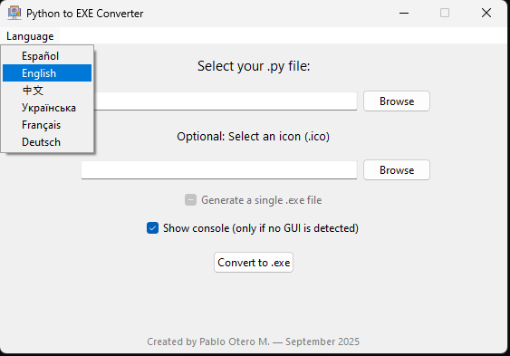
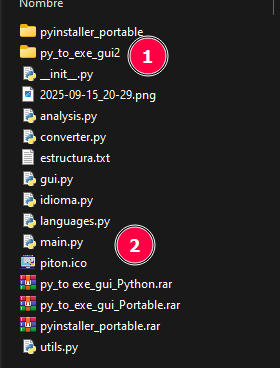
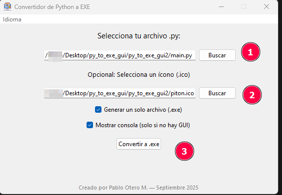
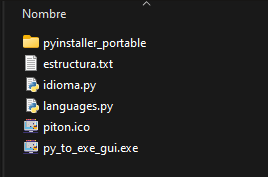

# py_to_exe_gui

Multilingual: Available in Spanish, English, French, German, Ukrainian, and Chinese.

# # 🐍💻 Convertidor de Python a EXE — por Pablo Otero M.
Septiembre 2025
Este programa ha sido diseñado para desarrolladores, estudiantes y entusiastas de Python que desean transformar sus scripts .py en aplicaciones ejecutables .exe de forma rápida, intuitiva y profesional.

# # 🎯 Características principales
- Interfaz gráfica amigable: Construida con Tkinter, permite seleccionar archivos, íconos y opciones de conversión sin necesidad de usar la terminal.
- Multilenguaje: Disponible en Español, Inglés, Francés, Alemán, Ucraniano y Chino. El idioma puede cambiarse dinámicamente sin reiniciar (modo Python).
- Detección automática de GUI: El programa identifica si el script tiene interfaz gráfica y ajusta la configuración de PyInstaller en consecuencia.
- Modo consola o ventana: Puedes elegir si el .exe debe mostrar consola o ejecutarse en modo silencioso.
- Conversión en un solo archivo: Opción para generar un .exe compacto y portable.
- Mensajes informativos: El usuario es notificado cuando comienza la conversión, incluso si el proceso tarda unos segundos.
- Créditos integrados: Reconocimiento elegante al autor en la interfaz, adaptado al idioma seleccionado.

# # 🧩 Versión Python (.py)
Ideal para desarrolladores que desean personalizar el código, agregar funciones o integrarlo en otros proyectos. Permite cambiar el idioma sin reiniciar y ofrece una experiencia fluida para pruebas y ajustes.

# # 📦 Versión Ejecutable (.exe)
Pensada para distribución final. El usuario puede convertir scripts sin tener Python instalado. Al cambiar el idioma, el programa se reinicia automáticamente para aplicar los cambios. Incluye un entorno portable para ejecutar PyInstaller sin dependencias externas.

# # 🛠️ Requisitos mínimos
- Windows 10 o superior
- Python 3.10+ (solo para versión .py)
- PyInstaller instalado (o entorno portable incluido en .exe)

Este convertidor es más que una herramienta: es una experiencia pensada para facilitar el trabajo del programador, con elegancia, eficiencia y un toque personal

# 📥 Descarga

Puedes descargar la versión portable para WINDOWS del programa desde el siguiente enlace:

# 👉 [Descargar py_to_exe_gui_Portable.rar](https://github.com/pablootero-cl/py_to_exe_gui/releases/download/v1.0.0/py_to_exe_gui_Portable.rar)

# # 📝 Cómo generar el ejecutable del programa

Debido a las limitaciones de GitHub (no permite subir archivos mayores a 25 MB), el archivo .exe no está incluido directamente en el repositorio. Sin embargo, puedes generarlo fácilmente utilizando el propio convertidor incluido en el proyecto.
🔧 Pasos para crear el ejecutable:
- Ejecuta el programa:
Abre una terminal y ejecuta el archivo principal:
py main.py o python main.py
- Duplica la carpeta del proyecto:
Copia la carpeta py_to_exe_gui y renómbrala, por ejemplo: py_to_exe_gui2

- Selecciona el archivo a convertir:
En la interfaz del convertidor, selecciona el archivo main.py ubicado dentro de py_to_exe_gui2.
- Selecciona el ícono:
Usa el ícono incorporado en el proyecto para personalizar el ejecutable.
- Haz clic en “Convertir”:
El proceso comenzará y tomará unos segundos.

- Ubica el ejecutable:
El archivo .exe generado estará dentro de la carpeta dist.
- Agrega los archivos necesarios:
Copia junto al .exe los siguientes archivos:
- idioma.py
- languages.py
- Descomprime el archivo pyinstaller_portable.rar en la misma ubicación
- La ruta se vera /pyinstaller_portable/ seguida da las carpetas LIB, Scripts, Include y 2 archivos, python.exe y pyvenv.cfg
- si vez /pyinstaller_portable/pyinstaller_portable/ la carpeta duplicada esta mal
- 

Con estos pasos, tendrás una versión ejecutable del programa lista para distribuir o usar sin necesidad de instalar Python.
